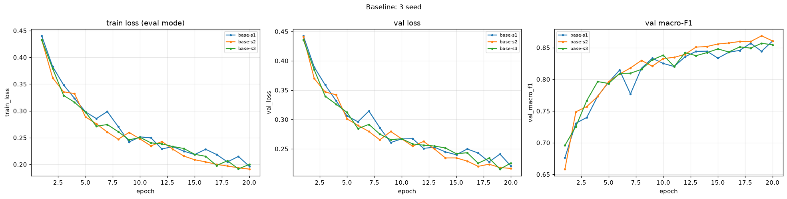
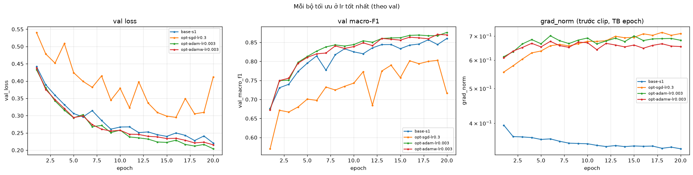
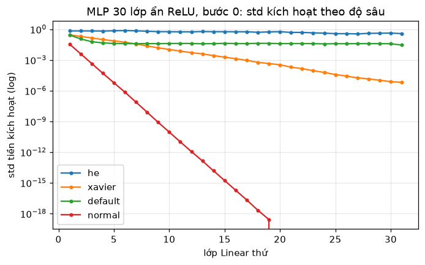
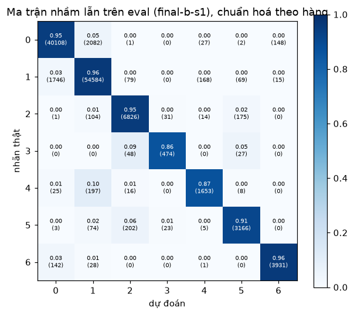

# Báo cáo Lab Day 1 — Võ Minh Quân — 2A202602429

Mọi con số trỏ về một `exp_id` trong `experiments.xlsx` (và `results/<exp_id>.json`). Mọi so sánh dùng **val macro-F1** với ngưỡng nhiễu 2σ của 3 seed baseline (mục 2). Tập eval chỉ dùng ở mục 4.

## 1. Thiết lập

- **Môi trường:** Google Colab, PyTorch 2.x. Các thí nghiệm chính (mục 3.1–3.5, 3.7, cấu hình cuối) chạy trên **CPU** vì runtime Colab chưa bật GPU. Vì vậy cột `time_per_epoch_s` là thời gian CPU và `peak_mem_MB` để trống. Thí nghiệm mixed precision (3.6) chạy trên GPU T4, so với mốc FP32 cũng chạy trên GPU.
- **Dữ liệu:** Forest CoverType; `train` 464 809 / `eval` 116 203 theo `split_metadata.csv`. Validation lấy 20% của train (phân tầng, seed 42), còn lại 371 847 train / 92 962 val. Tỉ lệ lớp ở ba tập giống nhau tới 4 chữ số. Chỉ chuẩn hoá 10 cột số, bằng mean/std của phần train còn lại.
- **Model:** `M-base` (54→256→128→7, 47 879 tham số, có `assert`), ReLU, không softmax trong model.
- **Baseline:** CE, SGD + momentum 0.9, **lr = 0.3** (chọn bằng val, mục 2), batch 512, 20 epoch, khởi tạo He (`kaiming_normal_`, bias = 0), dropout 0, không clip, FP32.
- **Mốc tham chiếu:** "đoán luôn lớp đa số" trên val cho accuracy 0.4876 (macro-F1 ≈ 0.094).
- **Chủ đề đã thử:** ☑ loss ☑ optimizer ☑ hyper-parameter ☑ dropout ☑ clipping ☑ mixed precision ☑ init — tổng 45 dòng trong bảng.

## 2. Kiểm tra ban đầu và độ nhiễu

| Kiểm tra | Kết quả |
|---|---|
| Số tham số / shape logits | 47 879 / (B, 7) |
| Loss bước 0 (ln 7 = 1.946) | 2.269 (seed 1); 1.978 / 1.901 (seed 2 / 3) |
| Quá khớp 20 mẫu (Adam 1e-3, 500 bước) | loss 1.97 → 2.7e-4, accuracy 20/20 |
| Mọi tham số có gradient khác 0 | ☑ có (W1…b3 đều có ‖grad‖ > 0) |
| Baseline, số seed | 3 (`base-s1..3`) |
| Baseline: val acc (TB ± σ) | 0.9137 ± 0.0010 |
| Baseline: val macro-F1 (TB ± σ) | 0.8592 ± 0.0021 |

**Ngưỡng nhiễu: 2σ = 0.0042 (val macro-F1).**

Loss bước 0 cao hơn ln 7 vì khởi tạo He áp cả cho lớp ra (không có ReLU phía sau), nên std của logit ≈ 0.58 thay vì ≈ 0 (bảng 3.7). Kiểm chứng: `init-normal` cho loss bước 0 = 1.9460 và `init-zeros` cho đúng 1.9459. Mức lệch phụ thuộc seed và không cản trở huấn luyện.

**Dò lr cho baseline** (SGD+momentum, seed 1, val macro-F1): 0.003 → 0.675, 0.01 → 0.765, 0.03 → 0.823, 0.1 → 0.850, **0.3 → 0.860**. Đường baseline (`base-s1.png`) có val loss giảm từ 0.443 xuống 0.221, best epoch = 20, khoảng cách val − train loss chỉ 0.024. Tức là mô hình **chưa hội tụ và chưa quá khớp**: nó đang chưa khớp vì thiếu thời gian và năng lực. Nhận định này giải thích phần lớn kết quả bên dưới.

## 3. Kết quả theo chủ đề

### 3.1 Hàm mất mát — CE vs MSE
- **Dự đoán:** MSE trên logit cho gradient ∂L/∂z = 2(z − y)/(7B), nhỏ hơn và không tăng theo mức sai như CE (softmax − y). Vì vậy MSE sẽ học chậm hơn.
- **Kết quả:** `loss-mse` (cùng lr) đạt macro-F1 **0.7794** so với 0.8592, tức **−0.080 ≫ 2σ**; accuracy 0.881 so với 0.914. grad_norm trung bình của MSE là 0.068, nhỏ hơn khoảng 5 lần so với CE (0.353). `loss-mse-lrx3.5` (lr 1.05, đổi 2 yếu tố có chủ đích) **sụp hoàn toàn**: dự đoán hằng, accuracy 0.4876, macro-F1 0.094. Val loss đứng yên ở 0.0889, đúng bằng MSE tối thiểu của một dự đoán hằng bằng tần suất lớp: (1 − Σp²)/7 ≈ 0.089.
- **Cơ chế:** MSE không ưu tiên mẫu sai nặng, nên lớp hiếm bị bỏ qua (macro-F1 giảm mạnh hơn accuracy). Tăng lr không bù được: gai gradient 14.2 ở epoch 1 đẩy các ReLU vào vùng chết, chỉ còn bias lớp ra học được. Không so trực tiếp giá trị loss CE với MSE vì khác thang đo. Ảnh: `compare_loss.png`.

### 3.2 Bộ tối ưu hoá
- **Dự đoán:** SGD cần lr lớn hơn khoảng 1/(1−μ) = 10 lần so với SGD+momentum. Adam xuống nhanh hơn. Ở lr tốt nhất của mỗi bộ, khoảng cách sẽ nhỏ.

| Bộ tối ưu (lr thử) | lr tốt nhất | exp_id | val macro-F1 | best epoch |
|---|---|---|---|---|
| SGD (0.03, 0.1, 0.3) | 0.3 | `opt-sgd-lr0.3` | 0.8016 | 16 |
| SGD+momentum (0.003 … 0.3) | 0.3 | `base-s1` | 0.8603 | 20 |
| Adam β=(0.9, 0.999) (3e-4, 1e-3, 3e-3) | 3e-3 | `opt-adam-lr0.003` | **0.8762** | 20 |
| AdamW wd 0.01 (3e-4, 1e-3, 3e-3) | 3e-3 | `opt-adamw-lr0.003` | 0.8697 | 20 |

- **Kết quả:** Adam hơn SGD+momentum **+0.016, gấp khoảng 4 lần 2σ**, nên khác biệt có ý nghĩa. Đây là khác biệt lớn hơn dự đoán. SGD thường ở lr 0.3 (0.802) ngang SGD+momentum ở lr 0.03 (0.823), khớp với lr hiệu dụng của momentum ≈ lr/(1−μ). Nó cũng dao động mạnh: macro-F1 ở epoch cuối chỉ 0.716. `opt-adamw-wd0-lr0.001` trùng **chính xác** `opt-adam-lr0.001` (|Δ val_loss| = 0), xác nhận Adam ≡ AdamW khi wd = 0.
- **Cơ chế:** Adam chia bước theo √v̂ của từng tham số, nên trọng số nối với các cột one-hot hiếm (gradient nhỏ, thưa) vẫn được cập nhật đủ lớn. Điều đó có lợi cho lớp hiếm và cho macro-F1. AdamW kém Adam 0.0065 (vượt 2σ một chút) vì suy giảm tách riêng thu nhỏ trọng số theo hệ số ≈ (1 − 3e-5)^14 540 ≈ 0.65. Với một mô hình đang chưa khớp, chính quy hoá chỉ có hại.
- **Độ nhạy lr:** nếu không chỉnh lr, kết luận có thể đảo ngược: Adam ở 3e-4 (0.796) thua SGD+momentum ở 0.3 (0.860). Ảnh: `compare_optimizer.png`, `compare_optimizer_lr_*.png`.

### 3.3 Hyper-parameter

| exp_id | thay đổi | bước/epoch | s/epoch (CPU) | val macro-F1 | Δ |
|---|---|---|---|---|---|
| `hp-batch128` | batch 128 | 2 906 | 7.2 | 0.7851 | −0.074 |
| `hp-batch2048` | batch 2048 | 182 | 3.0 | 0.8381 | −0.021 |
| `hp-batch2048-lrx4` | batch 2048 + lr 1.2 (2 yếu tố) | 182 | 3.1 | 0.7599 | −0.099 |
| `hp-wide` | M-wide 512-256 | 727 | 9.5 | **0.8765** | **+0.017** |
| `hp-deep` | M-deep 256-128-64 | 727 | 4.3 | 0.8504 | −0.009 |
| `hp-epochs40` | 40 epoch | 727 | 3.7 | **0.8798** | **+0.021** |

- **Đúng dự đoán:** mạng rộng hơn và nhiều epoch hơn đều giúp, vượt nhiễu, vì mô hình đang chưa khớp. Với batch 2048 cùng lr, số bước cập nhật trong 20 epoch giảm 4 lần nên kết quả kém hơn.
- **Khác dự đoán:** batch 128 kém. Độ lệch chuẩn của gradient tăng khoảng 2 lần (∝ 1/√B), và với lr 0.3 + momentum thì bước cập nhật quá ồn: val loss dao động, best epoch 12. Quy tắc tăng lr theo lô (×4) cũng thất bại: lr 0.3 đã gần biên ổn định, lr 1.2 lại không có khởi động nên tạo gai gradient 14.8 ở epoch 1. `M-deep` hơi kém (lr chọn cho M-base có thể chưa phù hợp). Ảnh: `compare_hparam_batch.png`, `compare_hparam_arch.png`.

### 3.4 Dropout
| exp_id | q | train loss | val loss | gap | val macro-F1 | Δ |
|---|---|---|---|---|---|---|
| `base-s1` | 0 | 0.196 | 0.221 | 0.024 | 0.8603 | +0.001 |
| `drop-0.1` | 0.1 | 0.228 | 0.242 | 0.014 | 0.8388 | −0.021 |
| `drop-0.3` | 0.3 | 0.316 | 0.320 | 0.004 | 0.7711 | −0.088 |
| `drop-0.5` | 0.5 | 0.418 | 0.421 | 0.003 | 0.6526 | −0.207 |

Đúng dự đoán. Dropout thu hẹp khoảng cách val − train, nhưng **cả hai** loss đều tăng (train loss đo ở chế độ `eval()`). Mô hình không quá khớp nên dropout chỉ làm giảm năng lực hiệu dụng. Ngay cả ở cấu hình cuối (M-wide, 40 epoch), `final-c` với q = 0.1 vẫn kém không dropout (0.9189 so với 0.9242). Ảnh: `compare_dropout.png`.

### 3.5 Gradient clipping
- **Chọn c:** grad_norm trung bình mỗi epoch của `base-s1` nằm trong 0.339–0.395 (trung vị 0.349), nên chọn **c = 0.35**. Ở mức này clipping kích hoạt ở **68%** số bước.
- **lr baseline:** `clip-c0.35` đạt 0.8564 (Δ −0.003, **trong 2σ**), không kết luận được khác biệt. Đúng dự đoán.
- **Phản chứng ở lr 3.0 (×10):** `clip-none-lr3` có gai grad_norm **163.5** ở epoch 1. Sau đó mạng chết: dự đoán toàn lớp 1, val loss ≈ 1.207 bằng entropy của phân phối lớp. Loss không ra NaN nên cờ diverged = N, nhưng thực chất mạng đã hỏng. `clip-c0.35-lr3` chặn được gai (max 4.7 trước clip) và mạng không chết hẳn, nhưng vẫn rất tệ (macro-F1 tốt nhất 0.20).
- **Khác dự đoán:** clip chặn ‖g‖ nhưng bước cập nhật vẫn là lr·c ≈ 1.05, và momentum cộng dồn thêm tới khoảng 10 lần. Clipping chữa được các gai **hiếm**, không chữa được lr sai một bậc độ lớn. Ảnh: `compare_clipping.png`.

### 3.6 Mixed precision
_(điền sau khi chạy AMP trên GPU T4: `amp-fp32-gpu`, `amp-fp16`, `amp-bf16`, `amp-wide-fp32-gpu`, `amp-wide-fp16`)_

### 3.7 Khởi tạo tham số
| init | std sau L1 / L2 / logit (bước 0) | loss bước 0 | val macro-F1 |
|---|---|---|---|
| `init-zeros` | 0 / 0 / 0 | 1.9459 | 0.0936 |
| `init-normal` (σ = 0.01) | 0.034 / 0.0038 / 0.0003 | 1.9460 | 0.8602 |
| `init-xavier` (`xavier_normal_`, Var = 2/(n_in+n_out)) | 0.276 / 0.218 / 0.192 | 2.0222 | 0.8604 |
| `init-default` (nn.Linear) | 0.274 / 0.113 / 0.059 | 1.9830 | 0.8603 |
| `base-s1` (He) | 0.661 / 0.640 / 0.577 | 2.2691 | 0.8603 |

- **`zeros`:** đúng dự đoán. Mọi kích hoạt bằng 0, mà ReLU'(0) = 0, nên W1, W2, W3 không có gradient; chỉ bias lớp ra học được tần suất lớp (accuracy 0.4876, val loss 1.205 = entropy). Kể cả khi gradient khác 0, các nơ-ron cùng lớp vẫn đối xứng và nhận cùng một cập nhật.
- **normal / xavier / default:** cho kết quả giống He trong mức nhiễu (|Δ| ≤ 0.0012). Mạng 3 lớp quá nông để thấy khác biệt khi huấn luyện; chỉ grad_norm cực đại ở đầu là khác nhau (0.78 / 1.24 / 0.90 so với 2.87).
- **Mạng 30 lớp, bước 0** (`compare_init_actstd.png`): std ở lớp 30 là **He 0.42**, Xavier 7.6e-6 (giảm √2 lần mỗi lớp vì thiếu hệ số 2 bù cho ReLU), normal 8e-30. Đây là hiện tượng trên slide: He giữ được thang đo kích hoạt, còn các cách khác làm nó tắt dần theo độ sâu.

## 4. Đánh giá cuối trên tập eval

**Chọn bằng val:** kết hợp những gì vượt nhiễu (Adam lr 3e-3, mạng rộng, nhiều epoch) cùng cosine annealing. Ba ứng viên: `final-a-s1` (M-base) 0.9104, **`final-b-s1` (M-wide) 0.9242**, `final-c-s1` (M-wide + dropout 0.1) 0.9189. Chọn **`final-b`**: Adam lr 3e-3, M-wide 512-256, 40 epoch, cosine, không dropout, He. Cấu hình này đổi nhiều yếu tố so với baseline, và cosine chưa được thử riêng (hạn chế).

| Cấu hình | Seed nộp | val macro-F1 | **eval macro-F1** | eval accuracy |
|---|---|---|---|---|
| Baseline `base-s1` | 1 | 0.8603 | **0.8666** | 0.9126 |
| Cấu hình cuối `final-b-s1` | 1 | 0.9242 | **0.9280** | **0.9530** |

- Trên val, 3 seed của cấu hình cuối cho **0.9248 ± 0.0009**, so với baseline 0.8592 ± 0.0021: cải thiện +0.066, khoảng 16 lần 2σ.
- Trên eval, cải thiện +0.061 macro-F1, +0.040 accuracy. Chỉ đánh giá eval cho seed 1 của mỗi cấu hình. Val và eval chênh 0.004–0.006, nên val là ước lượng tốt của eval.
- Số liệu lấy từ `eval_result.json` (cấu hình cuối) và `eval_result_baseline.json`, do `scripts/evaluate.py` tạo ra.

### 4.1 Phân tích lỗi theo lớp (cấu hình cuối, eval)

| Lớp | support | precision | recall | F1 | F1 baseline |
|---|---|---|---|---|---|
| 0 Spruce/Fir | 42 368 | 0.9544 | 0.9467 | 0.9505 | 0.9102 |
| 1 Lodgepole Pine | 56 661 | 0.9565 | 0.9633 | 0.9599 | 0.9268 |
| 2 Ponderosa Pine | 7 151 | 0.9518 | 0.9546 | 0.9532 | 0.8985 |
| 3 Cottonwood/Willow | 549 | 0.8977 | 0.8634 | 0.8802 | 0.8234 |
| 4 Aspen | 1 899 | 0.8849 | 0.8705 | **0.8776** | 0.7691 |
| 5 Douglas-fir | 3 473 | 0.9185 | 0.9116 | 0.9150 | 0.8175 |
| 6 Krummholz | 4 102 | 0.9602 | 0.9583 | 0.9592 | 0.9208 |

- **Lớp khó nhất là lớp 4 Aspen (F1 0.878)**, bị nhầm nhiều nhất sang **lớp 1 Lodgepole Pine (197/1 899 = 10.4%)**. Trên train, độ cao của Aspen (2 788 ± 97 m) nằm gọn trong dải của Lodgepole (2 921 ± 186 m), và cả hai đều ở Wilderness_Area 0 và 2. Lodgepole lại nhiều hơn khoảng 30 lần, nên vùng chồng lấn bị kéo về phía lớp đa số.
- **Lớp 3 Cottonwood/Willow (F1 0.880, chỉ 0.47% dữ liệu)** bị nhầm sang lớp 2 Ponderosa (48 mẫu, 8.7%) và lớp 5 Douglas-fir (27). Toàn bộ Cottonwood nằm ở Wilderness_Area 3, nơi cũng chứa 60% Ponderosa và 56% Douglas-fir, và độ cao các lớp này gần nhau (2 224 / 2 394 / 2 419 m).
- Về số tuyệt đối, nhầm lẫn lớn nhất là **Spruce/Fir ↔ Lodgepole** (2 082 và 1 746 mẫu): hai lớp lớn nhất, độ cao chồng lấn.
- Cấu hình cuối cải thiện mọi lớp, nhiều nhất ở lớp hiếm (Aspen +0.109, Douglas-fir +0.098). Cải tiến nên thử tiếp: trọng số lớp trong CE hoặc lấy mẫu cân bằng cho lớp 3/4, huấn luyện lâu hơn (val loss của `final-b` vẫn giảm tới epoch 39–40).

## 5. Trả lời các câu hỏi dẫn dắt

1. **Bộ tối ưu nào thắng khi chỉnh lr công bằng?** Adam (0.876) > AdamW (0.870) > SGD+momentum (0.860) ≫ SGD (0.802). Adam hơn SGD+momentum 0.016, khoảng 4 lần 2σ. Nếu không chỉnh lr, kết luận có thể đảo ngược tuỳ lr được chọn (Adam 3e-4 thua SGD+momentum 0.3).
2. **Dropout có giúp khi chưa quá khớp?** Không. Mọi q đều làm giảm macro-F1 từ 0.02 đến 0.21, và cả train lẫn val loss đều tăng. Chỉ nên dùng khi train loss thấp mà val loss bắt đầu tăng.
3. **Clipping giải quyết gì?** Nó chặn các gai gradient đột ngột: `clip-c0.35-lr3` giữ grad_norm ≤ 4.7, trong khi không clip lên tới 163.5 và làm mạng chết. Nhưng nó không thay thế được việc chọn lr đúng (vẫn chỉ đạt 0.20 macro-F1). Ở lr bình thường, clip không tạo khác biệt vượt nhiễu.
4. **Mixed precision có nhanh hơn không?** _(điền sau khi chạy AMP trên GPU)_
5. **Vì sao khởi tạo 0 hỏng? He khác Xavier ở đâu?** Khởi tạo 0 gây đối xứng, và ReLU(0) = 0 có đạo hàm 0, nên mạng không học được (`init-zeros`: macro-F1 0.094). He dùng Var = 2/n_in để bù việc ReLU cắt một nửa phương sai; Xavier (2/(n_in+n_out)) không bù. Với 3 lớp thì hai cách không khác nhau khi huấn luyện, nhưng ở 30 lớp, std kích hoạt của Xavier giảm còn 7.6e-6 trong khi He giữ khoảng 0.4.
6. **Loss không giảm sau 2 000 bước: 3 phép kiểm tra đầu tiên.**
   1. **Loss bước 0 có ≈ ln C không, và loss có đứng yên đúng ở entropy của phân phối lớp không?** Nếu đứng ở ≈ 1.205 thì mạng chỉ học tần suất lớp. Đây chính là dấu hiệu chung của `init-zeros`, `clip-none-lr3` và `loss-mse-lrx3.5`: chúng có ba nguyên nhân khác nhau nhưng cùng một triệu chứng.
   2. **In grad_norm theo từng lớp và theo bước.** Gradient bằng 0 ngay từ đầu nghĩa là lỗi khởi tạo hoặc gradient không chảy (`init-zeros`: 0.038). Một gai rất lớn rồi tụt về gần 0 nghĩa là lr quá cao làm ReLU chết (`clip-none-lr3`: 163.5 → 0.1). Từ đó mới quyết định giảm lr hay sửa khởi tạo.
   3. **Quá khớp một lô nhỏ (20 mẫu) khi tắt mọi chính quy hoá.** Phép này tách lỗi code (nhãn lệch, softmax hai lần, quên `zero_grad`, tham số không nằm trong optimizer) khỏi lỗi tối ưu hoá. Pipeline của mình qua được phép thử này (loss 2.7e-4, 20/20), nên mọi thất bại ở trên là do lr, khởi tạo hoặc hàm mất mát, không phải do code.

## 6. Hạn chế và điều bất ngờ

- **Khác dự đoán:** batch 128 kém thay vì tốt hơn; quy tắc lr ×4 theo lô thất bại (không có warmup); clipping không cứu được lr ×10; tăng lr cho MSE làm mạng sụp; khoảng cách Adam vs SGD+momentum lớn hơn dự đoán; M-deep không hơn M-base.
- **Thiết kế:** lr tốt nhất của SGD, SGD+momentum và Adam nằm ở **biên trên** của lưới dò, nên lr tối ưu thật có thể lớn hơn. Ngoài baseline và cấu hình cuối, mỗi thí nghiệm chỉ có 1 seed, nên ngưỡng 2σ giả định mọi cấu hình có nhiễu như baseline. Cùng số epoch nhưng khác batch nghĩa là khác số bước. Lần chạy lr ×10 quá mạnh; ×2–3 sẽ cho thấy rõ hơn tác dụng của clipping. Cấu hình cuối gộp nhiều yếu tố, và cosine chưa được thử riêng.
- **Môi trường:** thời gian của các thí nghiệm chính là thời gian CPU (Colab chưa bật GPU), nên không so sánh được với thời gian GPU ở 3.6.
- **Nếu có thêm thời gian:** mở rộng lưới lr lên trên; chạy 2–3 seed cho mỗi thí nghiệm; thử trọng số lớp cho Aspen và Cottonwood; thử warmup cho batch lớn; huấn luyện cấu hình cuối lâu hơn 40 epoch.

## 7. Phụ lục

- **Nộp:** `REPORT.md`, `experiments.xlsx`, `predictions_eval.csv` (cấu hình cuối `final-b-s1`), `eval_result.json`, `eval_result_baseline.json` (bổ sung), `figures/` (một ảnh `<exp_id>.png` cho mỗi dòng của bảng, cùng các ảnh `compare_*.png`), `results/<exp_id>.json`, `code/` (`lab.ipynb`, `data.py`, `model.py`, `optimizer.py`, `train.py`, `plots.py`, `results_table.py`, `runner.py`).
- **Thời gian chạy:** khoảng 1.4 giờ CPU (tổng epoch_time_s của 40 lần chạy, 3–15 s/epoch), cộng phần AMP trên GPU T4.
